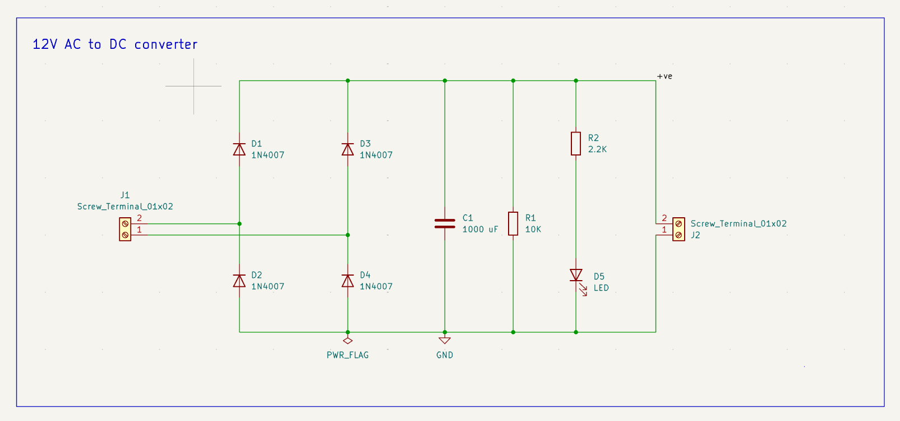
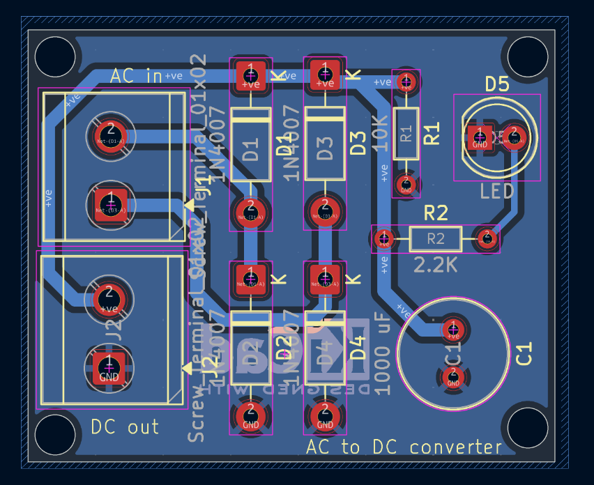
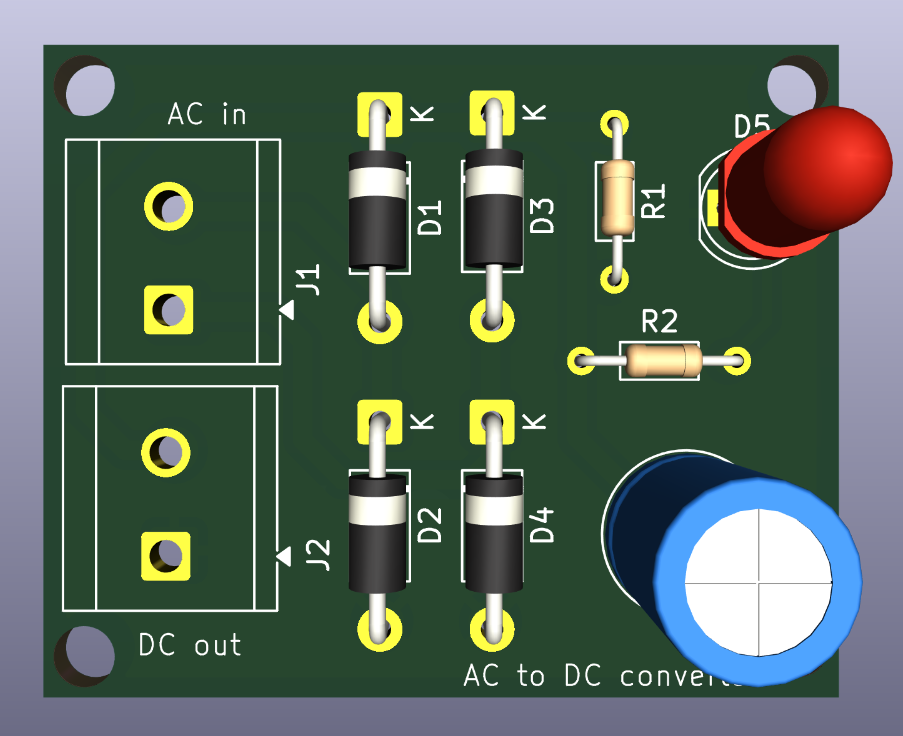

# AC to DC Converter – PCB Design

A PCB design for an AC to DC converter, created using KiCad.

## Overview

This project contains the schematic, PCB layout, and required 3D models for an AC to DC converter.

The project was developed to practice pcb designing

## Tools Used

* KiCad

## Reference

This project was created while following this YouTube tutorial for learning and reference:
https://youtu.be/dsz6Dzvou2o?si=fpQfjwIH6Eks47Hm

## Project Structure

```text
AC_to_DC_converter/
├── AC_to_DC_converter.kicad_pcb
├── AC_to_DC_converter.kicad_pro
├── AC_to_DC_converter.kicad_sch
└── 3dmodels/
    ├── Capacitor_THT.3dshapes/
    ├── Diode_THT.3dshapes/
    ├── LED_THT.3dshapes/
    └── Resistor_THT.3dshapes/
```

## Files

| File / Folder | Description                             |
| ------------- | --------------------------------------- |
| `.kicad_sch`  | Circuit schematic                       |
| `.kicad_pcb`  | PCB layout                              |
| `.kicad_pro`  | KiCad project file                      |
| `3dmodels/`   | Project-local 3D models used by the PCB |

## PCB Design

The PCB was designed using KiCad with through-hole components and routed connections.

The PCB layout includes components such as:

* Diodes
* Resistors
* Capacitor
* LED
* Terminal blocks

## 3D Models

The required component 3D models are included in the project under the `3dmodels/` directory.

The PCB uses project-local paths for these models, making the project more portable when shared with others.

## How to Open

1. Clone or download this repository.
2. Open the KiCad project file:

```text
AC_to_DC_converter.kicad_pro
```

3. Open the schematic or PCB Editor from KiCad.
4. Use **View → 3D Viewer** to inspect the PCB in 3D.

## Schematic



## PCB Layout



## 3D View




## Author

**Shruti Dorge**

---

*Designed using KiCad.*
