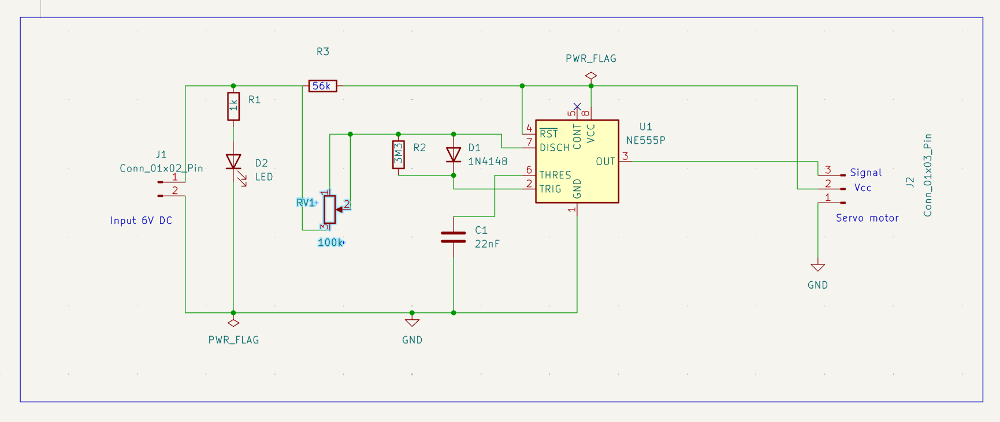
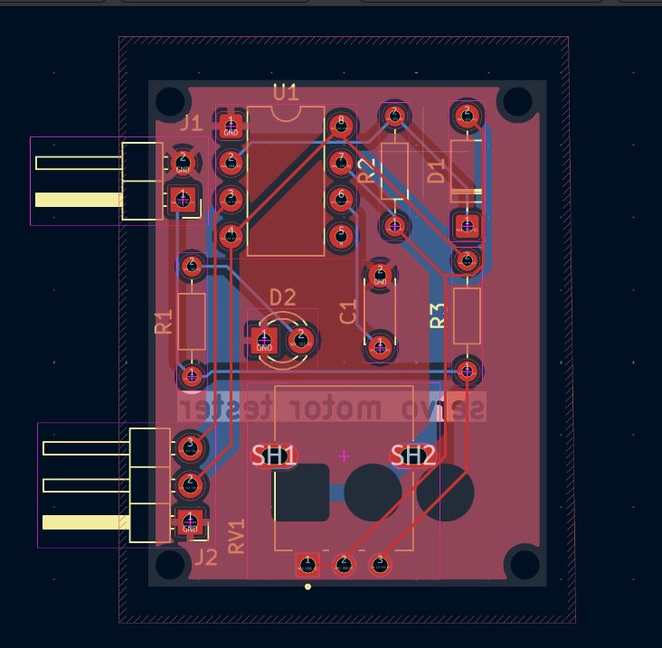
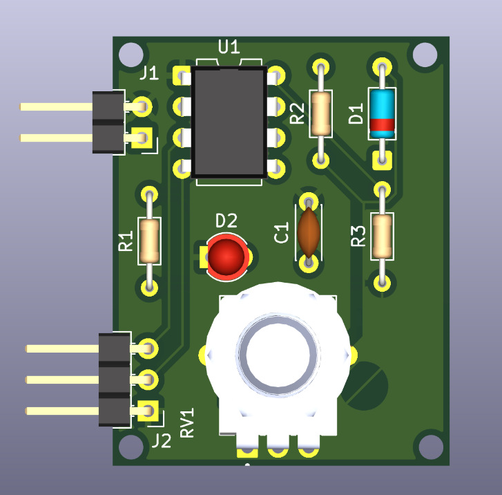

# Servo Motor Tester – PCB Design

A PCB design for a servo motor tester circuit, created using KiCad.

## Overview

This project contains the schematic and PCB layout of a servo motor tester, used to test whether a servo motor is functioning correctly by generating a variable PWM signal to sweep it through its range of motion.

The project was developed to practice PCB designing.

## Tools Used

* KiCad
* Snapmagic :  for downloading footprint & 3D model of potentiometer

## Reference

This project was created while following this YouTube tutorial by Ampnics, for learning and reference:

https://youtu.be/3BYGPpejStI?si=WuTzUE_sMDbFLJ6_

## Project Structure

```text
Servo motor tester/
├── 3D model of potentiometer/
│   └── RD901F-40-15R1-B100K-00DL1.step
├── Footprints.pretty/
│   └── POT_RD901F-40-15R1-B100K-00DL1.kicad_mod
├── Images/
│   ├── 3Dview.png
│   ├── pcb.png
│   └── schematic.png
├── Servo motor tester.kicad_pcb
├── Servo motor tester.kicad_pro
└── Servo motor tester.kicad_sch
```

## Files

| File / Folder  | Description                                                   |
| -------------- | ------------------------------------------------------------- |
| `.kicad_sch`   | Circuit schematic                                             |
| `.kicad_pcb`   | PCB layout                                                    |
| `.kicad_pro`   | KiCad project file                                            |
| `Images/`      | Project images showing the schematic, PCB layout, and 3D view |

## Components used

* NE555P Timer IC
* Resistors (x3)
* Unpolarized capacitor 
* 1N4148 diode
* LED 
* Potentiometer
* Connector header pins ( 01x02 pin for power supply)
* Connector header pins ( 01x03 pin for connecting servo motor )

## How to Open

1. Clone or download this repository.
2. Open the KiCad project file:

```text
Servo_motor_tester.kicad_pro
```

3. Open the schematic or PCB Editor from KiCad.
4. Use **View → 3D Viewer** to inspect the PCB in 3D.

## Schematic



## PCB Layout



## 3D View




## Author

**Shruti Dorge**

---

*Designed using KiCad.*
