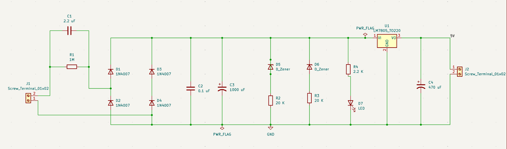
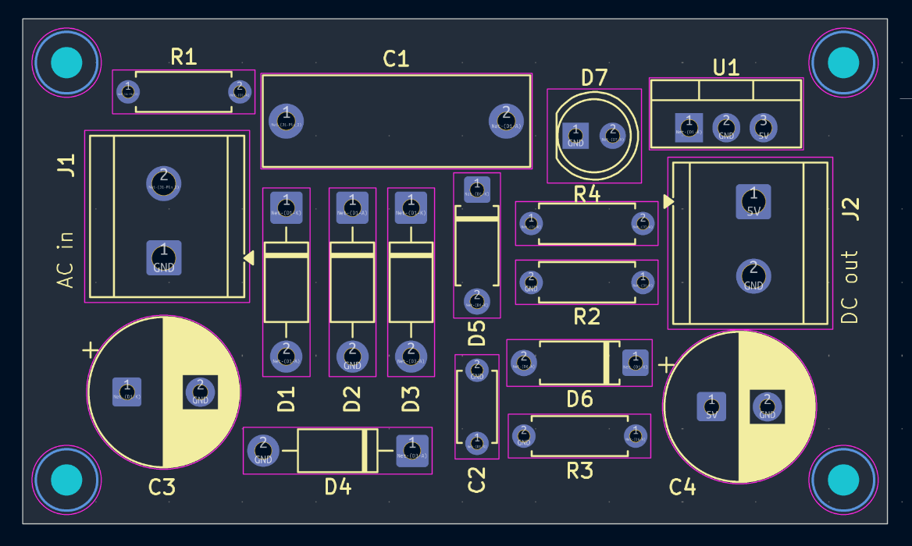
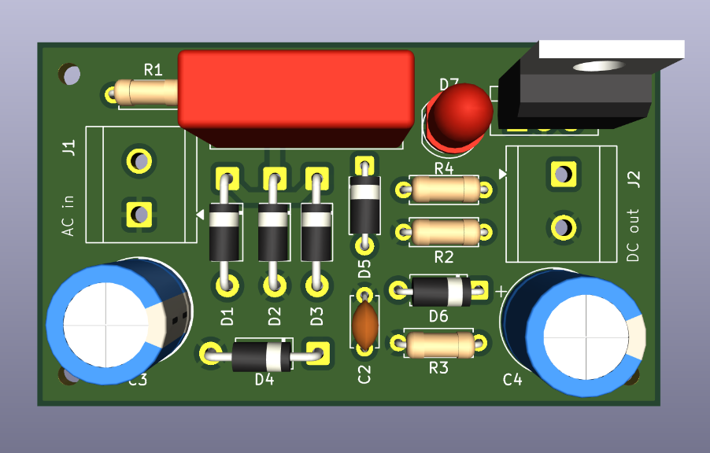

# Transformerless Power Supply – PCB Design

A PCB design for a transformerless power supply, created using KiCad.


## Overview

This project contains the schematic, PCB layout of transformerless power supply.

The project was developed to practice PCB designing


## Tools Used

* KiCad
  

## Reference

This project was created while following this YouTube tutorial for learning and reference:
https://youtu.be/qJ6HhyoyFbA?si=Ja4rXb8v6HYuZlvf


## Project Structure

```text
Transformerless_power_supply/
├── Transformerless_power_supply.kicad_pcb
├── Transformerless_power_supply.kicad_pro
├── Transformerless_power_supply.kicad_sch
├── Images/
    ├── Transformerless_power_supply_schematic.png
    ├── Transformerless_power_supply_pcb.png
    └── Transformerless_power_supply_3Dview.png

```

## Files

| File / Folder | Description                                                   |
| ------------- | ------------------------------------------------------------- |
| `.kicad_sch`  | Circuit schematic                                             |
| `.kicad_pcb`  | PCB layout                                                    |
| `.kicad_pro`  | KiCad project file                                            |
| `Images/`     | Project images showing the schematic, PCB layout, and 3D view |

## PCB Design

The PCB was designed using KiCad with through-hole components and routed connections.

The PCB layout includes components such as:

* 1N4007 Diodes (x4)
* Zener diode (x2)
* Resistors (x4)
* Unpolarized capacitor (x2)
* Polarized capacitor (x2)
* LED
* Terminal blocks (x2)
* LM7805_TO220 Voltage regulator 

## How to Open

1. Clone or download this repository.
2. Open the KiCad project file:

```text
Transformerless_power_supply.kicad_pro
```

3. Open the schematic or PCB Editor from KiCad.
4. Use **View → 3D Viewer** to inspect the PCB in 3D.
   

## Schematic



## PCB Layout



## 3D View



## Author

**Shruti Dorge**

---

*Designed using KiCad.*
